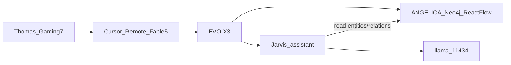

# ANGELICA = το γράφημα · επόμενο project = Jarvis

**Ναι, είναι εφικτό.** Δεν είναι ένα mega-app. Δύο ρόλοι στο ίδιο Mini PC, κοινό llama.

## Απόφαση 2026-08-13 (τελευταία)

| Όνομα | Τι είναι | Τι δεν είναι |
|--------|-----------|----------------|
| **ANGELICA** | Το **knowledge graph** του Second Brain | Ολόκληρο το Jinhua kiosk (chat, login, ingest ως προϊόν) |
| **Jarvis** | Το **επόμενο** assistant project (φωνή/agent) | Μέσα στο ίδιο Vite kiosk |

Κοινά στο EVO-X3: `llama-server` `:11434`, `~/models/`, Open WebUI, SearXNG. Cursor Remote SSH `evox3` + Fable 5.

GBrain Level 5 (`26`–`28`) μένει **προαιρετικό**. **Μην** τρέχεις `26` με το default — σταματά Neo4j και σκοτώνει το γράφημα. Default πλέον: `EVOX3_KEEP_GRAPH=1`.

## Τι είναι «το γράφημα» σήμερα

Ζει στο Jinhua clone `~/ai_apps/IncubativeSecondBrain` (μην το archive-άρεις):

- **Neo4j** `:7687` (Docker, unit `evox3-jinhua-docker`) — κόμβοι / σχέσεις
- **API** `:8000` — `/graph/analytics/*` (script `17`: orphans, PageRank, Louvain, bridges)
- **UI** `:5173` sidebar **Graph** — React Flow `GraphFlowWorkspace` (script `24`)

Αυτό κρατάμε ως ANGELICA. Chat/AuthScreen/kiosk autostart μπορούν να σβήσουν αργότερα χωρίς wipe της βάσης.

## Πώς κάθεται ο Jarvis δίπλα



Jarvis = **νέο process** (δικό του φάκελο, όχι μέσα στο `thoma` και όχι μέσα στο `~/gbrain-agent`). Ρωτάει το γράφημα μέσω HTTP (`:8000` graph APIs) και μιλάει με το τοπικό llama. Δεν αντικαθιστά το Graph tab.

## Τι λείπει για να τον στήσουμε

Σε αυτό το repo **δεν υπάρχει ακόμα Jarvis** (ούτε URL). Για scripts `29+` χρειάζεται:

- GitHub (ή τοπικό path) του Jarvis που θες
- Αν είναι voice: mic στο EVO-X3 vs Gaming-7

Μέχρι τότε: **μην** τρέχεις `26`/`27` ως «αντικατάσταση ANGELICA». Κράτα docker + API + Graph UI ζωντανά.

```bash
# Graph ζωντανό (EVO-X3, Cursor Remote)
systemctl --user is-active evox3-jinhua-docker.service evox3-jinhua-api.service evox3-jinhua-web.service
curl -sS -o /dev/null -w '%{http_code}\n' http://127.0.0.1:5173/
```

## Δεν κάνουμε

- Merge Jarvis μέσα στο Jinhua `App.tsx`
- `rm -rf` Neo4j volumes / `~/models`
- `npm install -g gbrain`
- Να ζητάμε επίσκεψη στην οθόνη του Mini PC
